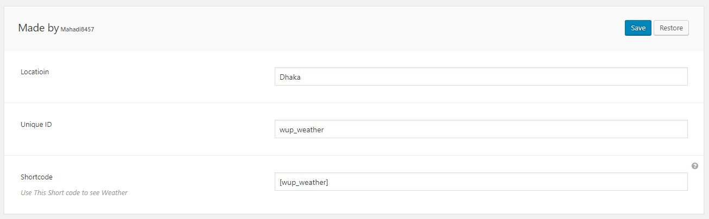
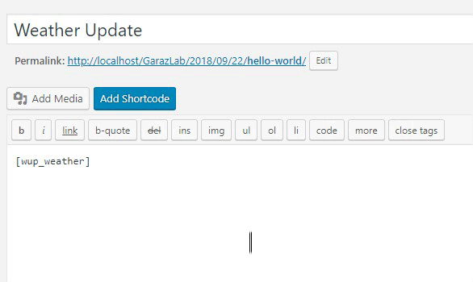
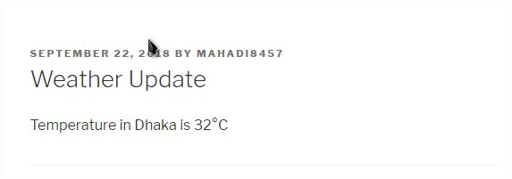

# Weather-Plugin
Weather Plugin is a simple plugin that helps you to show weather infor mation in any place of your post using shortcode.
# Here in the first image 
you can see a simple backend for the admins all you need to do 
is just type in the location name and a unique ID

# Just like the second image
You need to copy the shortcode and paste in the desired location

# @ The Final stage you can see the results
its that easy and simple

